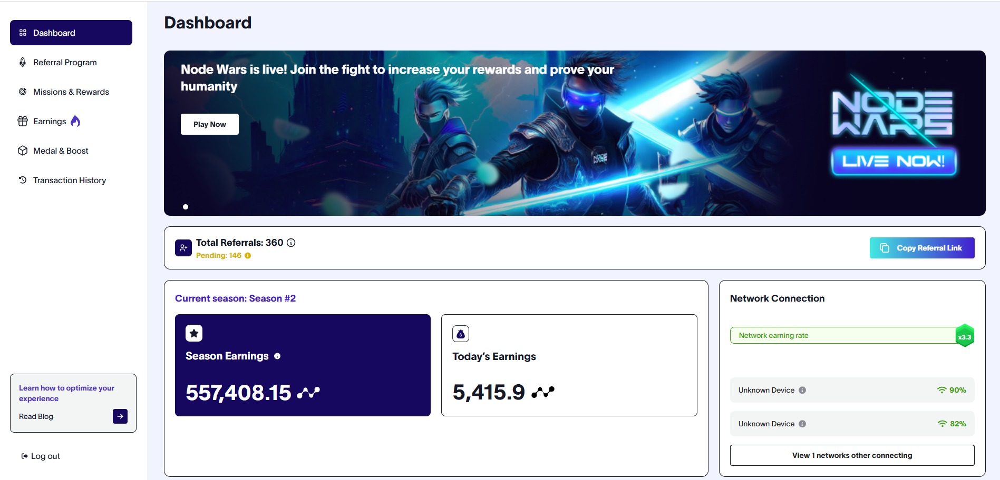

# Nodepay-Automate
- Daily Claim
- Multi Account Keep-Alive Support.
- USE PROXY TO SIMULATE MULTIPLE DEVICES ON NODEPAY AND EARN MORE POINTS


**Nodepay AI** before start the script you must have account in [Nodepay AI](https://app.nodepay.ai/register?ref=JOuAu89RUQAmQbd)
- Register to Nodepay [https://app.nodepay.ai](https://app.nodepay.ai/register?ref=JOuAu89RUQAmQbd)
- Insert invite code : `JOuAu89RUQAmQbd`
- Save your email and password
# WARNING
⚠️ "User assumes all responsibility and risk associated with the use of this bot/program script."
# How to run 
## clone the repository
```bash
git clone https://github.com/nongdancryptos/Nodepay.git
cd Nodepay
```
## install the requirements
```bash
python -m venv env
```
```bash
 env\scripts\activate
```
```bash
 pip install -r req.txt
```
## run the script
```bash
python main.py
```
# NOTE

- **Paste your proxies inside ```proxy.txt``` and the token inside ```tokens.txt```**
- **To use multiple accounts, in which case one proxy from each line will be assigned to one token in each line (1 token = 3 proxy), paste all your tokens in the ```token.txt``` file and make sure there are matching number of proxies in the ```proxy.txt``` file.**


## Donations

If you would like to support the development of this project, you can make a donation using the following addresses:

- **Solana**: `3rYhoVL8g28iwjGQq8hKw4bvVmBGhyC8DEbKAwzmy4wn`
- **EVM**: `0x431588aff8ea1becb1d8188d87195aa95678ba0a`
- **BTC**: `bc1pu30mhlegcajqq23ff30vrlnlnsmv0ha6ufwaenv0em4ap8dfzyrqwsvjx5`

## Contributing

Feel free to open issues or submit pull requests if you have improvements or bug fixes.

## License

This project is licensed under the MIT License. See the [LICENSE](LICENSE) file for details.
